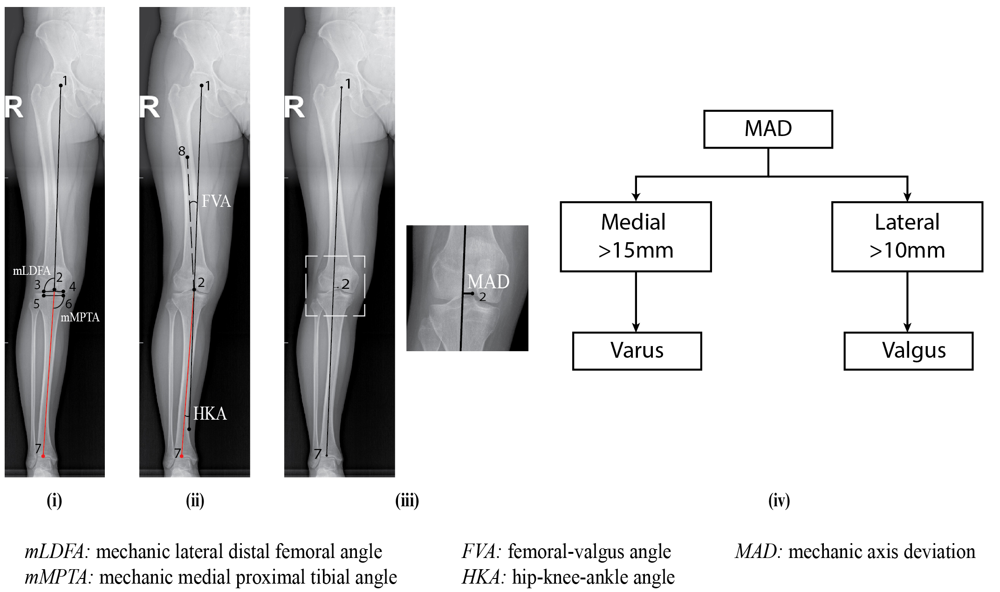
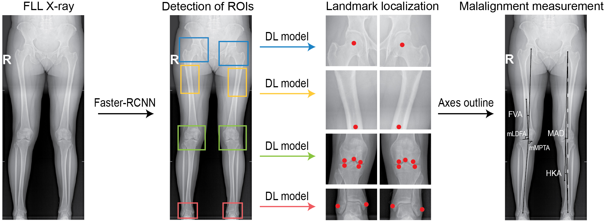
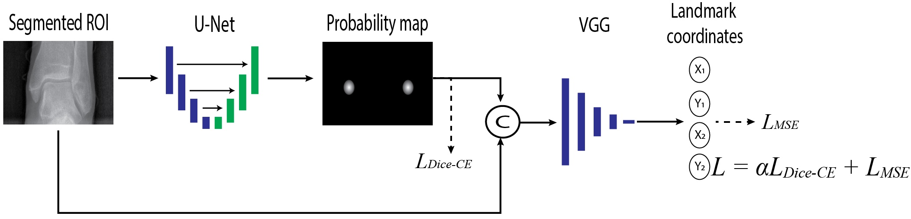
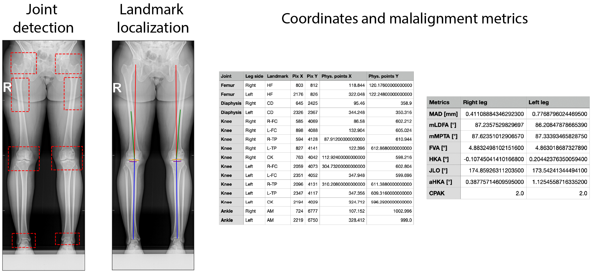

# Segmentation-Guided Coordinate Regression
The goal of this repository is to support research on lower-limb malalignment assessment through automated anatomical 
landmark localization in full lower-limb (FLL) radiographs. It allows users to evaluate the provided pre-trained models 
on their own data. Due to third-party data-sharing restrictions, the datasets used for training and evaluation cannot be 
publicly released. However, pre-trained model weights are available (see the [instructions](#download-weights) on how to 
download them). Scripts are provided with clear documentation on usage, expected inputs, and outputs.

⚠️ **Notes:** 
- Active maintenance of this repository is not guaranteed.
- The provided models are intended for **research purposes only** and have not been validated for clinical use.

For a detailed description of the methodology and results, refer to the associated [paper](https://ieeexplore.ieee.org/abstract/document/10510285).

---

## Citation
If you use this repository or any of its components (e.g., models, functions, or pipelines), please cite:

```bibtex
@article{sanchez2024segmentation,
  title={Segmentation-guided coordinate regression for robust landmark detection on X-rays: application to automated assessment of lower limb alignment},
  author={Sanchez, Sebastian Amador and Van Overschelde, Philippe and Vandemeulebroucke, Jef},
  journal={IEEE Access},
  volume={12},
  pages={61484--61497},
  year={2024},
  publisher={IEEE}
}
```

---

## Introduction

Accurate identification of anatomical landmarks is a fundamental task in medical image analysis. In orthopedic imaging, 
a key application of landmark localization is the assessment of lower-limb malalignment. Clinical evaluation is 
typically performed using full lower-limb (FLL) radiographs, where predefined anatomical landmarks are manually 
annotated. After landmark identification, anatomical and mechanical axes are constructed, from which clinically relevant 
angles are derived.



**Figure 1.**  *Left:* Landmarks required for malalignment assessment.  *Right:* Definition of valgus–varus deformity.

---

## Methodology

We propose a two-stage pipeline for automatic landmark localization on full lower-limb radiographs:

1. **Region of Interest (ROI) Detection:**  A Faster R-CNN model detects hip, diaphysis, knee, and ankle regions for 
both legs.
2. **Landmark Localization:** Four independent deep learning models (one per anatomical region: hip, femoral diaphysis,
knee, and ankle) estimate landmark positions. A total of nine landmarks are localized per leg (see Figure 2); after 
landmark position estimation, anatomical axes are constructed and malalignment metrics are computed.



**Figure 2.** Two-stage pipeline: ROI detection followed by landmark localization and axes construction.

---

## Segmentation-Guided Coordinate Regression (SGR)

The proposed SGR method consists of two components:

1. **Landmark Segmentation:** A U-Net predicts probability maps representing landmark locations using small circular masks.
2. **Coordinate Regression:** The probability maps are concatenated with the original X-ray image and passed to a CNN 
(VGG-like backbone) with a fully connected layer to regress landmark coordinates. Each landmark is represented by two 
outputs corresponding to its $(x, y)$ coordinates.



**Figure 3.** Segmentation-guided coordinate regression architecture.

---

## Installation
### I. Virtual environment
Tested with **Python 3.9.12**. First, create a virtual environment, then install all the dependencies:

```bash
python3.9 -m venv sgr_env
source sgr_env/bin/activate
pip install --upgrade pip setuptools wheel
pip install -r requirements.txt
```

### II. Download weights
The weights for each of the models can be accessed through Hugging Face. Before downloading the weights, refer to the 
weights' [README](https://huggingface.co/samador7/sgr-lnd-det-v1) for additional details. To download the weights use 
the following command:

```bash
python DownloadWeights.py
``` 

### III. Notes
- By default, PyTorch may be installed in CPU-only mode. To enable GPU acceleration, install the appropriate CUDA 
version from: https://pytorch.org/get-started/previous-versions/
- Device selection is handled automatically:
```python
import torch
device = torch.device("cuda" if torch.cuda.is_available() else "cpu")
```

---

## Repository Structure

After cloning this repository and downloading the weights from Hugging Face, you will have the following structure:

```
- Figures/        → Images used in the README
- Functions/      → Utility functions for pre- and post-processing
- Models/         → Model definitions
- Weights/        → Downloaded pre-trained weights
- DiaphysisSgm.py
- Main.py
- RoiDetection.py
- SGR.py
- README.md
- LICENSE
- requirements.txt
```

---

## Usage
### I. Input Data
The pipeline expects full lower-limb radiographs organized in one of the following directory structures:

```
Images/
├── Image1.dcm
├── Image2.dcm
```

or

```
Images/
├── Subject_1/
│   └── subject1.dcm
├── Subject_2/
│   └── subject2.dcm
```

> **Notes** 
> * The images should be frontal FLL radiographs with both legs completely visible.
> * `DICOM` format is recommended, but standard image formats (`.jpg` and `.png`) are also supported. 
> * The models were trained using pre- and post-operative radiographic images; therefore, it is possible to analyze 
cases with orthopedic devices. Nevertheless, a suboptimal performance has been observed in low quality images and those 
containing occluding external devices.

### II. Running the Pipeline
For `DICOM` images:

```bash
python Main.py path_to_dicom_images True
```

For non-medical images:

```bash
python Main.py path_to_images False
```

- First argument: path to images  
- Second argument: `True` for `DICOM`, `False` otherwise

### III. Output
An `Outputs/` directory will be automatically generated:

```
Outputs/
├── Subject1/
├── Subject2/
```

Each subject folder contains:

1. **`*_boxes.png`** → Detected joint regions.

2. **`*_FLL_SGR_Axes.png`** → Overlay of anatomical and mechanical axes.

3. **`*_FLL_SGR_coordinates.csv`** → Landmark coordinates (pixel and physical units). ⚠️ For non-DICOM images, 
physical coordinates are identical to pixel coordinates.

4. **`*_Malalignment.csv`**  → Computed metrics for each leg side:
   - Mechanical Axis Deviation (MAD) [mm] | ⚠️ MAD is reported in pixels for non-medical images.
   - Mechanical Lateral Distal Femoral Angle (mLDFA) [deg]
   - Mechanical Medial Proximal Tibial Angle (mMPTA) [deg]
   - Femoral Valgus Angle (FVA) [deg]
   - Hip-Knee-Ankle angle (HKA) [deg] 
   - Arithmetic HKA (aHKA) [deg]
   - Joint Line Obliquity (JLO) [deg]
   - Coronal Plane Alignment of the Knee (CPAK) class

5. **`*_SGR_512px_coordinates.csv`** → Landmark coordinates in a 512×512 reference system.



**Figure 4.** Expected outputs.

## License

See [LICENSE](LICENSE) file for details.